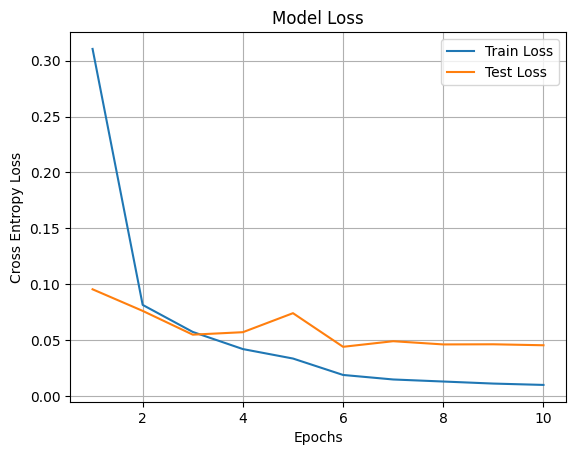
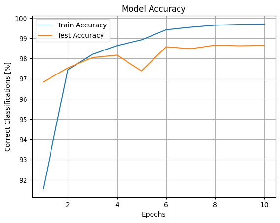
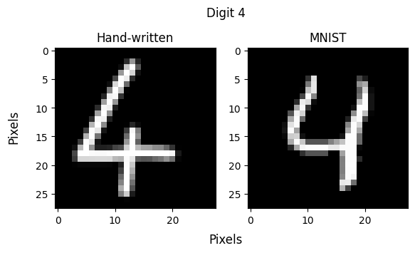

<h1>Handwritten Digit Recognizer</h1>

This repo contains a Flask web app that classifies a digit (0-9) drawn by the user in a browser via a Machine Learing  (ML) model. You can choose between two models for classificaton: one being a built-in Logistic Regressor from sklearn
(trained on the digit dataset provided by sklearn), the other one a custom-built, more tunable Convolutional Neural Network (CNN) using the framework PyTorch (trained on the MNIST dataset).

  
  &nbsp;&nbsp;
  

The Loss and Accuracy curves of the CNN during training show that the model quickly gets to the point where the validation plateaus and it starts to overtrain. The initial learning rate was set to be $1 \cdot 10^{-4}$ 
and was deacreased by 50% after 5 epochs.
The performance of the CNN on unlabeled client-drawn digits is still not quite satisfying; this is probably due to the mismatches in drawing style compared to the training data.

  

